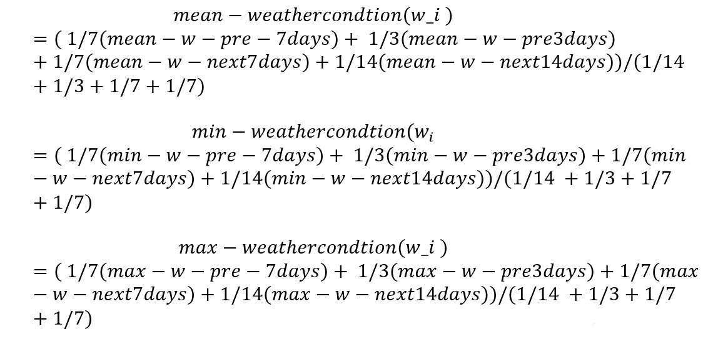
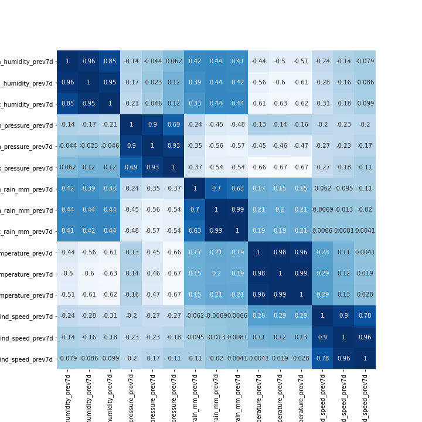
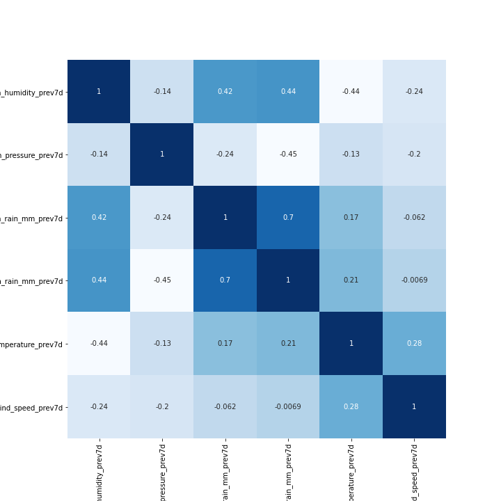

### This Repository contains the project for the course [Data Mining and Text Mining](https://www11.ceda.polimi.it/schedaincarico/schedaincarico/controller/scheda_pubblica/SchedaPublic.do?&evn_default=evento&c_classe=691572&polij_device_category=DESKTOP&__pj0=0&__pj1=17f53de47fb15c45b12fba90714f19a6)
________________________
- Academic year 2020-2021
- 1st semester of 2st year
- [Politecnico di Milano](https://www.polimi.it/)
________________________
#### Professors
* [Lanzi Pierluca](https://www4.ceda.polimi.it/manifesti/manifesti/controller/ricerche/RicercaPerDocentiPublic.do?evn_didattica=evento&k_doc=88664&polij_device_category=DESKTOP&__pj0=0&__pj1=f435c06e8d2aab326cc7a730bde8ad9c)
________________________
#### Teaching Assistance
* [Fernando Benjamin Perez Maurera](https://www.deib.polimi.it/eng/people/details/1189928)
________________________
#### Collaborators
* Saeid Rezaei
* Abdolvakil Fazli
* Tara Tandel
* Ghodrat Rezaei
________________________
## Introduction 

This report is aimed at explaining the methodology that was chosen to analyze and do the classification based on Predictive Maintenance data set for prediction of faults on air conditioning equipment installed mobile network transition site in a 14-days forecast window. Available information is related to weather conditions (past and forecast), alarms and faults occurred on site, statistic features of the site. Generally, we have 621299 number of observations and 136 features for two years (2019-2020) time intervals which in each date there are set of observation falling and the class target(aircon_sum_wo_target_next_14d) is binary values of 0 and 1 which shows the presence of a fault in the following 14 days.

##	Data Visualizing and Preprocessing 
### Data Quality Assurance

As the first step in the data processing and preparation, the attribute (‘Site ID’, ‘Date’) were dropped, because they were less informative toward the target and also the attribute ’N_TRANSPORTED_SITES’ was dropped because it is used as probability weighted of 0.8 for Daily group in the final step. Then we checked whether there are missing to remove them. There was no missing value.
Having two kinds of features which are Categorical Features which has been already one hot encoded (CELL_TYPE_X, GEOGRAPHICAL CLUSTER x) and Numerical attributes which have integer or float values(mean/max/min_w_prevXd, mean/max/min_w_f_nextXd, cat_sum_alarms_prevXd, cat_mean/max/min_persistance_prevXd, skew_cat_alarms_prev14d, kurt_cat_alarms_prev14d), we sepearted them into two group.
Visualization of numerical data was also represented in histograms was taken to better understand of the distribution of data. Since some features may have the outlier and have different distributions different from normal distribution, Power Transformation Scaler was used to transform so-called distributions to Gaussian distribution. Having all the numerical attribute in small scale, we were able to detect outlier better and thereby to replace them with upper and lower bound.
###	 Feature Aggregation
Since numerical features have statistical properties, we did analytical calculations and implementation on them.
Due to the recent weather conditions (3 or 7 days) have high informativity with respect to the (14 days), we did average weighted on them(following figures).
 

  

 

  

Drawing the correlation matrix with heat map tools, covariances each two variables were shown. Thereby by defining the threshold 0.85, we removed one of the correlated features
 

  

For the Alarms duration features, we did the same.
    Then for the features cat_mean/max/min_persistance_prevXd, we did the above process.
    Normalizing skewness, kurtosis indicator of the sum-alarms distribution over time and number of alarms during 3,7,14 days between -1 and +1, we implemented statistical implementation. As an example for normalized skewness of a certain device measurement between (-0.2,-1) and normalized kurtosis of (-0.2,0.2) we have the below distribution over time.
 

  

Accordingly we did weighed average on the number of alarms pre 3,7 and 14 days with respect to the normalize skewness and kurtosis. When we have such behave of the distribution (shown above), previous 14 days sum-alarms have more weight with respect to the previous 3 or 7 days.
Again for the normalized skewness between (0.2 , 1) and skewness (0.2,1) which means the distribution near mean value has extreme frequencies
 

  

    As shown above, number of alarms for cat measurement has more weight during previous 3 or 7 days and less weight toward previous 14 days. Aggregating so-called features with weighted average mentioned in first part, we decreased the number of features to 5 which is shown in (following figures).
Aggregated equipment sums alarms - Aggregated fire/smoke sum alarms-
Aggregated ge sum alarms- Aggregated power sum alarms- Aggregated temperature sum alarms
 

  

## Feature Selection 
After doing the feature aggregation and concatenating the aggregated numerical features and categorical features, we did feature selection in order to select more informative and important features. Target class has 617717 of 0 and 3583 of 1 value. So, the target values have been distributed in an unbalanced manner. The algorithm receives significantly more examples from one class, prompting it to be biased towards that particular class. It does not learn what makes the other class “different” and fails to understand the underlying patterns that allow us to distinguish classes.
The algorithm learns that a given class is more common, making it “natural” for there to be a greater tendency towards it. The algorithm is then prone to overfitting the majority class. Just by predicting the majority class, models would score high on their loss-functions. In these instances, the Accuracy Paradox appears.
Our Approach was to oversampling and down sampling of the classes, leading to better estimation of base line performance in order to be able to do the feature selection methods. We used 4 different methods of feature selections on the oversampled data frame 
 

  

As it is shown in the chart best feature selection method is PCA with performance of (f1-mean, variance =0.02).

## Model Selection
After trying some simple regression models such as Linear Regression and Lasso, we decided to focus on more complex tools. We used the Python library Sklearn to get all of our models. Since our target is unbalanced, we did the oversampling before feeding Our models.
For all the models, we first split the data into Train and Test set and performed a 3 fold cross validation on the train set to obtain the best combination of parameters. We kept 30% of the data as a test set even if performing cross validation, to be sure that the model predicted was effective also on data never seen from the model. Since the training was done only on 70% of the entire set, the evaluation is likely to assume values slightly pessimistic compared to the real ones. Nonetheless, the final model, used for the prediction delivered, was built on the entire dataset, thus not influencing the real error of our algorithm. 
For each model, we defined the Model Structure itself and Parameterization space by which the greedy search(gs) approach can iteratively examine through the defined space of parameters and pick up the best parameter which can give us the minimum amount of error. By defining the cross-validation (cv) equal to 3 in greedy search, probability of over-fitting will decrease significantly. Here are shown Different Models with f1-score for training and test set

